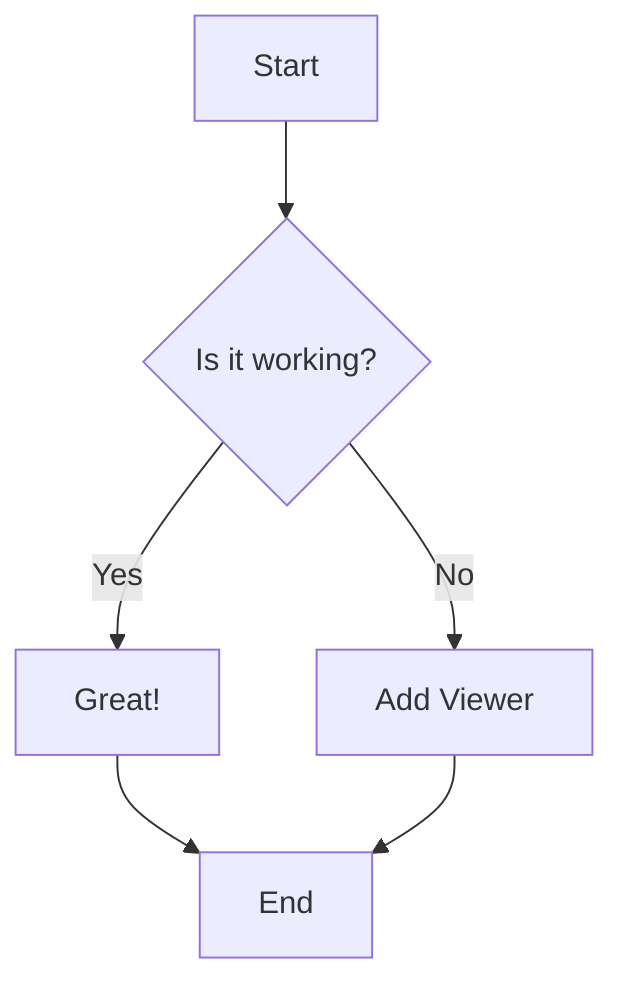
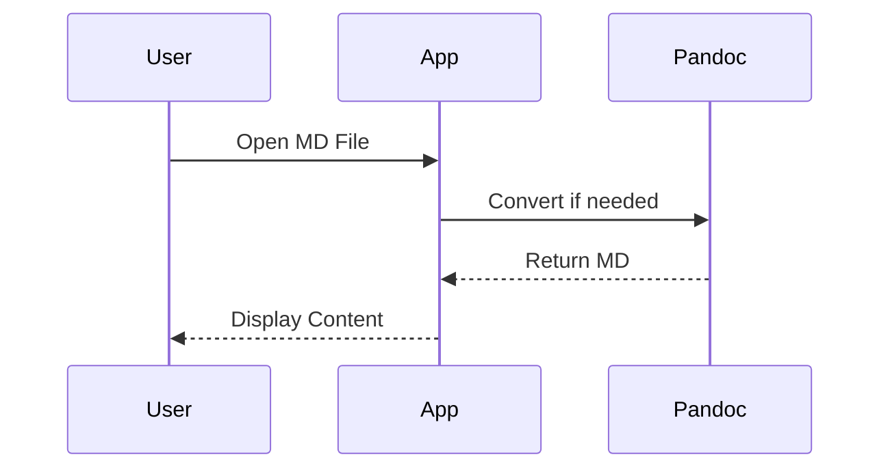
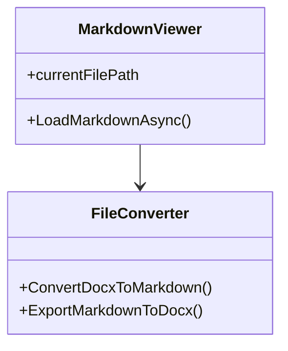
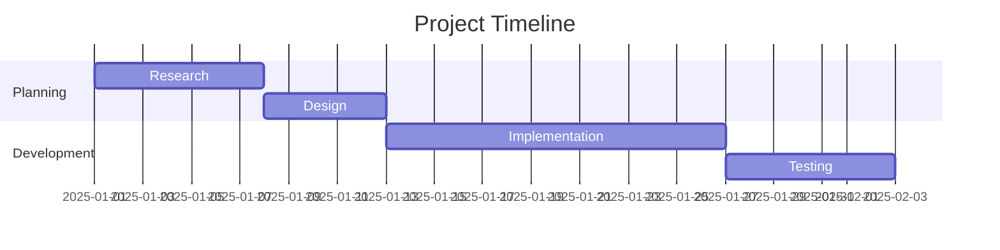
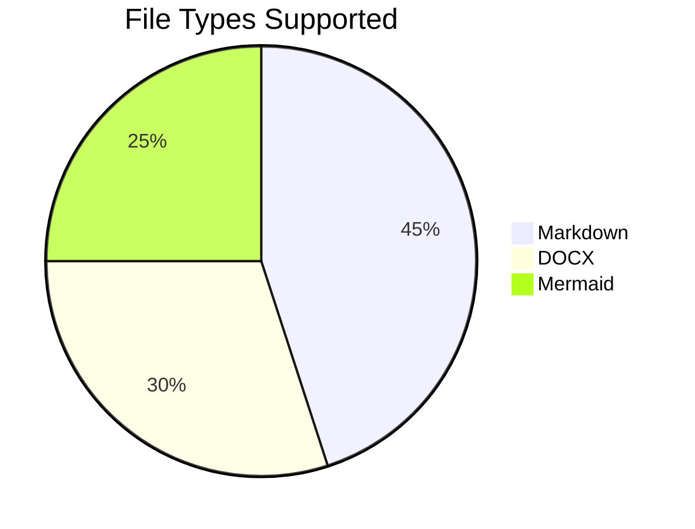
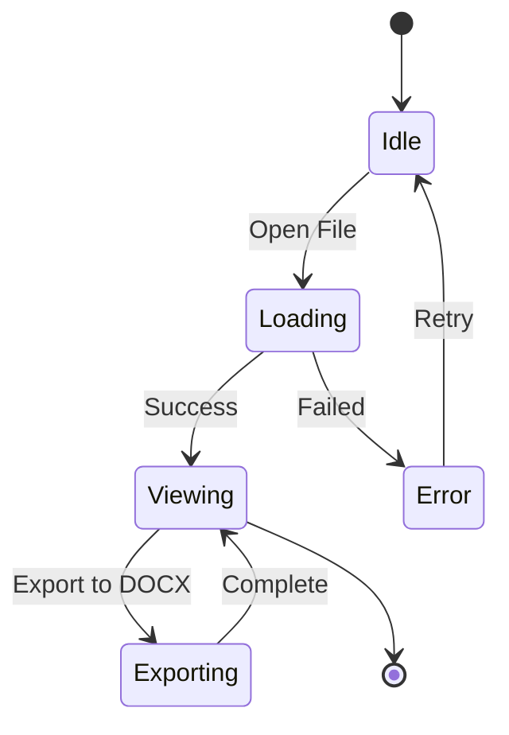

# Mermaid Diagram Test File

This file tests various Mermaid diagram types to see if they render correctly.

## Flowchart

## Sequence Diagram

## Class Diagram

## Gantt Chart

## Pie Chart

## State Diagram

